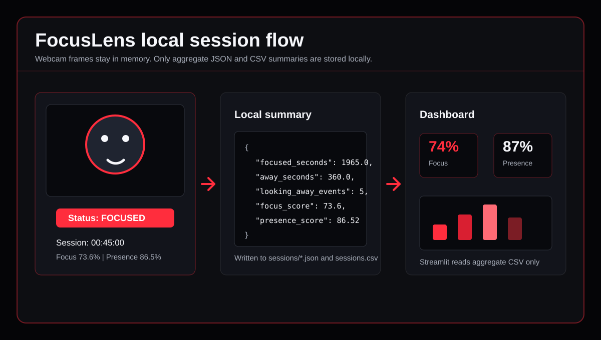

<div align="center">


[](#tech-stack)
[](#download)
[](#tech-stack)
[](#tech-stack)
[](#dashboard)
[](LICENSE)
[](https://github.com/Flames4fun/Focuslens/actions/workflows/ci.yml)

<br />


<p>
  <a href="https://github.com/Flames4fun/Focuslens/releases/latest">
    
  </a>
</p>

</div>

## Overview

**FocusLens** is a privacy-first local focus tracker. It uses your webcam,
OpenCV, and MediaPipe face landmarks to estimate simple work-session signals:
presence, attention direction, away time, camera distance, and session scores.

It is made for study, deep work, development sessions, and creators who want
feedback without turning focus tracking into surveillance.

> FocusLens estimates useful local signals. It does not identify people,
> diagnose fatigue, measure emotions, or upload camera data.

## Download

The easiest way to try FocusLens on Windows is the release ZIP:

1. Open [Releases](https://github.com/Flames4fun/Focuslens/releases/latest).
2. Download `FocusLens-windows-x64.zip`.
3. Extract the ZIP.
4. Double-click `FocusLens.exe`, or run:

```powershell
.\FocusLens.exe run
```

Open the dashboard from the same ZIP:

```powershell
.\FocusLens.exe dashboard
```

The Windows build bundles the default MediaPipe Face Landmarker model, so you
do not need to download a separate model file for the EXE.

## Quick Start

### Windows Release

Double-click `FocusLens.exe` to start a focus session.

Terminal usage:

```powershell
.\FocusLens.exe run
.\FocusLens.exe dashboard
```

Controls:

| Key | Action |
| --- | --- |
| `p` | Pause or resume attention analysis. |
| `q` | Quit and save the session summary. |
| `Esc` | Quit and save the session summary. |

Session summaries are saved locally under:

```text
sessions\
```

### From Source

Use Python 3.14 for local development and release validation.

```bash
git clone https://github.com/Flames4fun/Focuslens.git
cd Focuslens
python -m venv .venv
```

Windows:

```powershell
.\.venv\Scripts\activate
python -m pip install -e ".[dev,build]"
focuslens run
```

macOS / Linux:

```bash
source .venv/bin/activate
python -m pip install -e ".[dev]"
focuslens run
```

## Demo

<div align="center">



<br />


</div>

A privacy-safe real demo is planned for the first public release page. It
should blur, crop, or cover the camera image while keeping the FocusLens overlay
and dashboard visible.

## What It Tracks

| Signal | Meaning |
| --- | --- |
| `FOCUSED` | A face is visible and appears oriented toward the screen. |
| `LOOKING_AWAY` | A face is visible, but the head or gaze direction appears shifted. |
| `AWAY` | No face is visible in the camera frame. |
| `TOO_CLOSE` | The face is too close to the camera. |
| `TOO_FAR` | The face is too far from the camera. |
| `PAUSED` | The session is manually paused. |
| `UNKNOWN` | A face is visible, but orientation cannot be estimated from available landmarks. |

## Features

| Area | Included |
| --- | --- |
| Webcam loop | Local OpenCV preview with pause and quit controls. |
| Face landmarks | Local MediaPipe Face Landmarker model. |
| Attention states | Focused, looking away, away, too close, too far, paused, unknown. |
| Session metrics | Focus score, presence score, timed states, and event counts. |
| Local storage | JSON session files and aggregate `sessions.csv`. |
| Dashboard | Local Streamlit dashboard for history and charts. |
| Release | PyInstaller Windows EXE and GitHub release workflow. |
| Privacy | No video storage, no image storage, no accounts, no cloud upload. |

## How It Works


Frames stay in memory. FocusLens writes only aggregate summaries when saving is
enabled.

## Dashboard

The dashboard reads `sessions/sessions.csv` and shows your local session
history:

- weighted focus and presence scores;
- latest session and best focus score;
- aggregate state timing;
- counted away and looking-away events;
- focus and presence trend charts;
- state distribution;
- session history table.

Run it from the Windows release ZIP:

```powershell
.\FocusLens.exe dashboard
```

Run it from the source environment:

```powershell
.\.venv\Scripts\activate
focuslens dashboard
```

Fallback:

```powershell
streamlit run dashboard.py
```

The dashboard does not inspect webcam frames, session JSON files, secrets, or
external services.

## Release Build

FocusLens includes a local Windows build script:

```powershell
powershell -NoProfile -ExecutionPolicy Bypass -File .\scripts\build_windows_exe.ps1
```

Outputs:

```text
dist\FocusLens.exe
dist\FocusLens-windows-x64.zip
```

The GitHub workflow `.github/workflows/windows-exe.yml` builds the same ZIP for
tagged releases such as `v0.1.0`.

The packaged EXE supports both:

```powershell
.\FocusLens.exe run
.\FocusLens.exe dashboard
```

Release documentation lives in [docs/release.md](docs/release.md).

## Project Status

Current release prep, checked on 2026-05-06:

- Python 3.14 target.
- CI runs Ruff and pytest on Python 3.14.
- Windows EXE build workflow is present.
- `assets/face_landmarker.task` is included and validated.
- Local EXE build was validated with `FocusLens.exe --version` and
  `FocusLens.exe run --help`.
- The packaged EXE includes the Streamlit dashboard command.
- Looking-away classification uses normalized horizontal head-turn scoring.
- Test suite passes with `153 passed`.
- Ruff, Ruff format check, and `pip check` pass.

Manual release work left:

- run a real webcam smoke test;
- publish a privacy-safe demo;
- create the GitHub release and attach `FocusLens-windows-x64.zip`.

## Example Session Summary

```json
{
  "away_events": 2,
  "away_seconds": 360.0,
  "ended_at": "2026-04-27T09:45:00+00:00",
  "focus_score": 73.6,
  "focused_seconds": 1965.0,
  "looking_away_events": 5,
  "looking_away_seconds": 210.0,
  "paused_seconds": 30.0,
  "presence_score": 86.52,
  "started_at": "2026-04-27T09:00:00+00:00",
  "too_close_seconds": 45.0,
  "too_far_seconds": 60.0,
  "total_seconds": 2700.0,
  "unknown_seconds": 30.0
}
```

## Privacy

FocusLens is designed around privacy by default:

- webcam frames are processed locally in memory;
- images and videos are not saved by default;
- session files store aggregate metrics only;
- `sessions/` is ignored by Git;
- no account is required;
- no cloud upload is required;
- the project does not identify people.

Session summaries can still reveal personal work patterns because they include
timestamps and focus metrics. Review custom save directories before syncing or
sharing them.

Read the full privacy contract in [docs/privacy.md](docs/privacy.md).

## Tech Stack

| Layer | Tool | Role |
| --- | --- | --- |
| Language | Python 3.14 | Application, CLI, tests, and data processing. |
| Vision | OpenCV | Webcam access, frame handling, and overlays. |
| Landmarks | MediaPipe | Local face landmark detection. |
| Dashboard | Streamlit | Local web dashboard for session metrics. |
| Data | pandas | CSV reading, tables, and chart-friendly summaries. |
| Packaging | PyInstaller | Windows executable build. |
| Quality | pytest + Ruff | Tests, linting, and formatting. |

## Repository Map

```text
focuslens/
|-- .github/workflows/
|   |-- ci.yml
|   `-- windows-exe.yml
|-- assets/
|   |-- demo.svg
|   `-- face_landmarker.task
|-- docs/
|   |-- architecture.md
|   |-- privacy.md
|   |-- release.md
|   `-- roadmap.md
|-- examples/
|   `-- sample_session.json
|-- scripts/
|   |-- build_windows_exe.ps1
|   `-- focuslens_launcher.py
|-- focuslens/
|   |-- attention.py
|   |-- camera.py
|   |-- cli.py
|   |-- config.py
|   |-- dashboard.py
|   |-- face_tracker.py
|   |-- overlay.py
|   |-- session.py
|   `-- storage.py
|-- tests/
|-- dashboard.py
|-- pyproject.toml
|-- README.md
|-- CONTRIBUTING.md
`-- LICENSE
```

## Limitations

FocusLens is intentionally lightweight. It estimates useful signals, not
absolute truth.

- Poor lighting can reduce detection quality.
- Face angle and camera position affect classification.
- It is not a medical, fatigue, emotion, or productivity diagnosis tool.
- It should not be used for employee monitoring or remote surveillance.

## Roadmap

| Phase | Focus |
| --- | --- |
| `0.1.0` | Windows ZIP release, local webcam run, packaged dashboard, session summaries. |
| Next | Real webcam smoke test, privacy-safe demo, first public release polish. |
| Later | Pomodoro mode, YAML config, desktop notifications, HTML reports, calibration. |

See [docs/roadmap.md](docs/roadmap.md) for the working release checklist.

## Contributing

Contributions are welcome. Start with [CONTRIBUTING.md](CONTRIBUTING.md) for
setup, checks, privacy guardrails, and good first areas.

## License

FocusLens is released under the [MIT License](LICENSE).

<div align="center">


</div>
